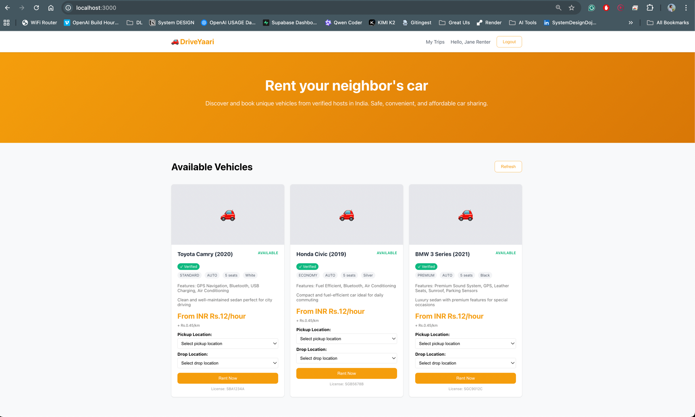
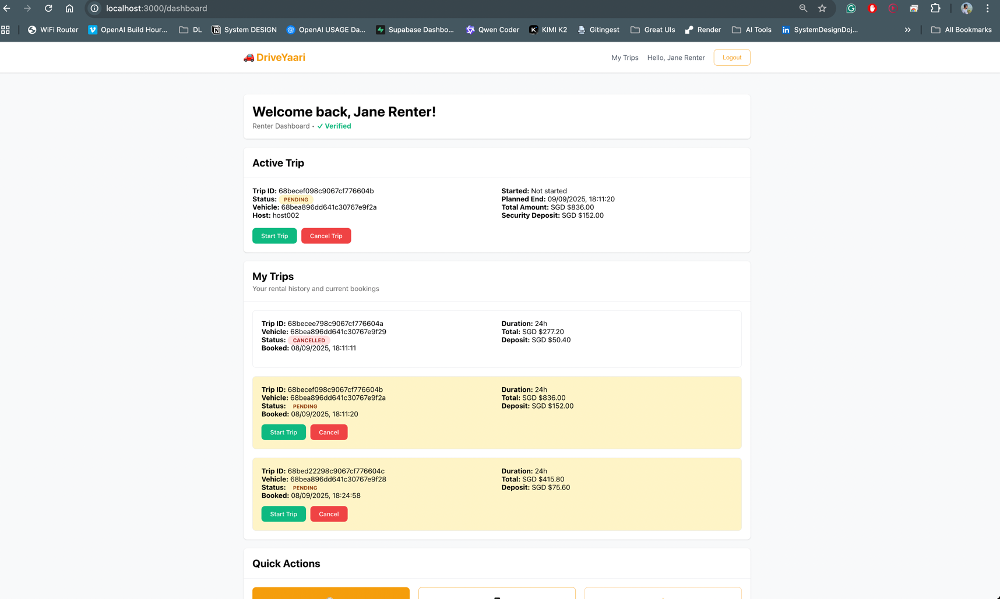

# Readme

This project is a clone of P2P Car rental platform : Drive lah.
And named as "Drive Yaari"

## It implements the core functionalities
- Host can list their vehicles
- Renter can see the listing and fare
- Renter can choose a vehicle and start a trip
- Renter can Cancel or Complete the trip
- Historical trips can be seen

## Tech Stack
- Java Spring boot
- MongoDB
- React JS, HTML, CSS -> written by claude

## Major Learnings
- How to expose api endpoints
- How to configure port through application.yml
- How MongoDB establishes connection
  - Mongo Template, and Mongo Config
- How to write a generic Mongo Repository that talks with db and carry all the CRUD operations.
- How @ComponentScan works?
- How Auth Flow works? What is JWT token in details
- How spring web, spring data dependencies provide boilerplate code that makes easy to connect and work

## Screenshots

